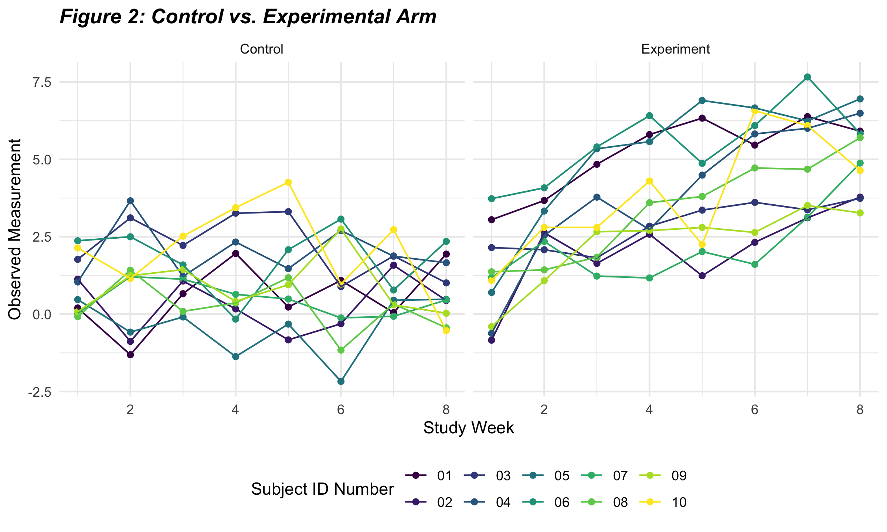

Homework 5
================
jys2137
11/19/2021

The purpose of this file is to present the answers to Homework 5, an
assignment reinforcing ideas in the **Iteration** topic for P8105.

## Contents

**Problem 1**

-   **1.1.** Data import
-   **1.2.** Raw data description
-   **1.3.** Data cleaning
-   **1.4.** Total number of homicides and unsolved homicides
-   **1.5.** Proportion of unsolved homicides in Baltimore
-   **1.6.** Running `prop.test` for each of the cities in the dataset
-   **1.7.** Creating a plot: Proportion of unsolved cases in 50 major
    US cities

**Problem 2**

-   **2.1.** Importing the data
-   **2.2.** Cleaning the data
-   **2.3.** Spaghetti plot of observations over time
-   **2.4.** A comment on differences between groups

**Problem 3**

-   **3.1.** Loading in the `iris` dataset
-   **3.2.** Writing a function
-   **3.3.** Final checks

## Problem 1

This problem uses data on homicides in 50 large U.S. cities gathered by
the *Washington Post*.

#### 1.1. Data import

The code below imports the raw data made available through a GitHub
repository.

``` r
hom_url <- 'https://raw.githubusercontent.com/washingtonpost/data-homicides/master/homicide-data.csv'
hom_read <- read_csv(url(hom_url), na = c(" ","Unknown", "NA"))
```

    ## Rows: 52179 Columns: 12

    ## ── Column specification ────────────────────────────────────────────────────────
    ## Delimiter: ","
    ## chr (8): uid, victim_last, victim_first, victim_race, victim_sex, city, stat...
    ## dbl (4): reported_date, victim_age, lat, lon

    ## 
    ## ℹ Use `spec()` to retrieve the full column specification for this data.
    ## ℹ Specify the column types or set `show_col_types = FALSE` to quiet this message.

#### 1.2. Raw data description

The **raw** dataset has **52179** observations and **12** variables,
including the *reported date* of the homicide; the *name*, *race*,
*age*, and *sex* of the victim; and the *city*, *state*, and *longitude*
and *latitude* of the homicide. Note that there is a possible data entry
error of 1 observation reported as being in *Tulsa, AL* (which does not
exist; *Tulsa* is in *OK*).

#### 1.3. Data cleaning

The following code chunk **cleans the data** by:

-   creating a `city_state` variable which combines city and state
-   creating a `resolution` variable indicating if a case was closed
    with or without arrest
-   excluding the 1 observation reported as being in *Tulsa, AL*

``` r
homicide_df = 
  hom_read %>%
  mutate(
    city_state = str_c(city, state, sep = ", "),
    resolution = case_when(
      disposition == "Closed without arrest" ~ "unsolved",
      disposition == "Open/No arrest"        ~ "unsolved",
      disposition == "Closed by arrest"      ~ "solved")) %>% 
  relocate(city_state) %>% 
  filter(city_state != "Tulsa, AL") 
```

The **new, cleaned** dataset has **52178** observations and **14**
variables.

#### 1.4. Total number of homicides and unsolved homicides

The next code chunk summarizes ***within cities*** to obtain:

1.  The **total** number of homicides
2.  The number of **unsolved** homicides (those for which the
    disposition is “Closed without arrest” or “Open/No arrest”).

``` r
cities_df = 
  homicide_df %>% 
  select(city_state, disposition, resolution) %>% 
  group_by(city_state) %>% 
  summarize(
    unsolved = sum(resolution == "unsolved"),
    n = n())

knitr::kable(cities_df,
             col.names = c("City", "Unsolved Murders", "Total Murders"))
```

| City               | Unsolved Murders | Total Murders |
|:-------------------|-----------------:|--------------:|
| Albuquerque, NM    |              146 |           378 |
| Atlanta, GA        |              373 |           973 |
| Baltimore, MD      |             1825 |          2827 |
| Baton Rouge, LA    |              196 |           424 |
| Birmingham, AL     |              347 |           800 |
| Boston, MA         |              310 |           614 |
| Buffalo, NY        |              319 |           521 |
| Charlotte, NC      |              206 |           687 |
| Chicago, IL        |             4073 |          5535 |
| Cincinnati, OH     |              309 |           694 |
| Columbus, OH       |              575 |          1084 |
| Dallas, TX         |              754 |          1567 |
| Denver, CO         |              169 |           312 |
| Detroit, MI        |             1482 |          2519 |
| Durham, NC         |              101 |           276 |
| Fort Worth, TX     |              255 |           549 |
| Fresno, CA         |              169 |           487 |
| Houston, TX        |             1493 |          2942 |
| Indianapolis, IN   |              594 |          1322 |
| Jacksonville, FL   |              597 |          1168 |
| Kansas City, MO    |              486 |          1190 |
| Las Vegas, NV      |              572 |          1381 |
| Long Beach, CA     |              156 |           378 |
| Los Angeles, CA    |             1106 |          2257 |
| Louisville, KY     |              261 |           576 |
| Memphis, TN        |              483 |          1514 |
| Miami, FL          |              450 |           744 |
| Milwaukee, wI      |              403 |          1115 |
| Minneapolis, MN    |              187 |           366 |
| Nashville, TN      |              278 |           767 |
| New Orleans, LA    |              930 |          1434 |
| New York, NY       |              243 |           627 |
| Oakland, CA        |              508 |           947 |
| Oklahoma City, OK  |              326 |           672 |
| Omaha, NE          |              169 |           409 |
| Philadelphia, PA   |             1360 |          3037 |
| Phoenix, AZ        |              504 |           914 |
| Pittsburgh, PA     |              337 |           631 |
| Richmond, VA       |              113 |           429 |
| Sacramento, CA     |              139 |           376 |
| San Antonio, TX    |              357 |           833 |
| San Bernardino, CA |              170 |           275 |
| San Diego, CA      |              175 |           461 |
| San Francisco, CA  |              336 |           663 |
| Savannah, GA       |              115 |           246 |
| St. Louis, MO      |              905 |          1677 |
| Stockton, CA       |              266 |           444 |
| Tampa, FL          |               95 |           208 |
| Tulsa, OK          |              193 |           583 |
| Washington, DC     |              589 |          1345 |

#### 1.5. Proportion of unsolved homicides in Baltimore

Focusing on the city of *Baltimore, MD*, we use the `prop.test` function
to estimate the proportion of homicides that are unsolved and the
`broom::tidy` function to pull the estimated proportion and confidence
intervals from the resulting dataframe.

``` r
baltimore_df =
  homicide_df %>% 
  filter(city_state == "Baltimore, MD")

baltimore_summary = 
  baltimore_df %>% 
  summarize(
    unsolved = sum(resolution == "unsolved"),
    n = n())

 baltimore_test =
   prop.test(
    x = baltimore_summary %>% pull(unsolved), 
    n = baltimore_summary %>% pull(n)) 
 
 
baltimore_test %>% 
  broom::tidy() %>% 
  select(-parameter, -alternative) %>% 
  rename(Estimate = estimate,
         Statistic = statistic,
         "p-value" = p.value,
         Method = method,
         "CI Lower Bound" = conf.low, 
         "CI Upper Bound" = conf.high) %>% 
  knitr::kable(digits = 3,
               caption = "_**Table 1: Estimate and CI of the Proportion of Unsolved Homicides In Baltimore**_",
               align = "ccccclc")
```

| Estimate | Statistic | p-value | CI Lower Bound | CI Upper Bound | Method                                               |
|:--------:|:---------:|:-------:|:--------------:|:--------------:|:-----------------------------------------------------|
|  0.646   |  239.011  |    0    |     0.628      |     0.663      | 1-sample proportions test with continuity correction |

***Table 1: Estimate and CI of the Proportion of Unsolved Homicides In
Baltimore***

#### 1.6. Running `prop.test` for each of the cities in the dataset

Next, we run `prop.test` for each of the cities in the dataset, and
extract both the **proportion of unsolved homicides** and the
**confidence interval** for each. This is done within a “tidy” pipeline,
making use of `purrr::map`, `purrr::map2`, and `unnest`.

``` r
results_df = 
  cities_df %>% 
  mutate(test_results = map2(.x = unsolved, .y = n, ~prop.test(x = .x, n = .y)),
         tidy_results = map(test_results, broom::tidy)) %>% 
  select(-test_results) %>% 
  unnest(tidy_results) %>% 
  select(city_state, estimate, starts_with("conf"))
```

#### 1.7. Creating a plot: Proportion of unsolved cases in 50 major US cities

The code chunk below creates a **plot** that shows the \*estimates** and
**CIs\*\* for each city – and uses `geom_errorbar` to add error bars
based on the upper and lower limits. Cities are organized according to
the proportion of unsolved homicides.

``` r
results_df %>% 
  mutate(city_state = fct_reorder(city_state, estimate)) %>% 
  ggplot(aes(x = city_state, y = estimate)) + 
  geom_point(color = "darkred") + 
  geom_errorbar(aes(ymin = conf.low, ymax = conf.high)) + 
  theme(axis.text.x = element_text(angle = 90, vjust = 0.5, hjust = 1),
        plot.title = element_text(face = "bold.italic" )) +
  labs(title = "Figure 1: Proportion of unsolved cases in 50 major US cities", 
       y = "Estimated Proportion of Unsolved Homicides", 
       x = "City", 
       caption = "*Note: Error bars indicate 95% confidence interval")
```


***Figure 1*** illustrates that across the 50 major U.S. cities, rates
at which homicides are solved vary greatly. Notably, **Chicago, IL** has
a distinctly high proportion of unsolved homicides, at **over 0.7**.
This unfortunately makes sense, as Chicago is a city with a high rate of
homicides overall. In stark comparison, the lowest proportion of
unsolved homicides is in **Richmond, VA**, at just above **0.25**.

## Problem 2

This problem involves data from a longitudinal study that included a
control arm and an experimental arm. Data for each participant is
included in a separate file, and file names include the `subject ID` and
`arm`.

#### 2.1. Importing the data

First, we import the data from each separate file of the study through
the following steps:

-   Create a dataframe `files_df` that includes the names of all 20
    files and the path to each file using `list.files`
-   Use `purrr::map` for the paths and save the result as a new
    variable, `file_name`
-   Import data using `read_csv`
-   Use `unnest` to accommodate for the `map` results

``` r
files_df =
  tibble(
    files = list.files("./data/"),
    path = str_c("./data/", files)) %>% 
    mutate(file_name = map(path, read_csv, col_types = "dddddddd")) %>% 
    unnest()
```

#### 2.2. Cleaning the data

Now, we tidy the result of the previous data import through the
following steps:

-   Manipulate the file name to include `study arm` and subject ID
    (`subj_id`)
-   Use string replacements for the file names
-   Ensure weekly observations are tidy
-   Change the dataframe from wide to long
-   De-select variables that are not meaningful for our understanding of
    the data

``` r
tidy_df = 
  files_df %>% 
  mutate(file_name = str_replace(files, ".csv", "")) %>% 
  mutate(file_name = str_replace(file_name, "./study_data/", "")) %>% 
  separate(file_name,
           into = c("study_arm", "subj_num"),
           sep = "_",
           remove = FALSE) %>% 
  rename(subj_id = file_name) %>% 
  pivot_longer(
    week_1:week_8,
    names_to = "week",
    values_to = "observations",
    names_prefix = "week_") %>% 
  mutate(week = as.numeric(week),
         study_arm = case_when(str_detect(files, "exp") ~ "Experiment",
                               str_detect(files, "con") ~ "Control")) %>% 
  select(study_arm, subj_num, subj = files, week, observations)
```

#### 2.3. Spaghetti plot of observations over time

Here, we make a **spaghetti plot** showing observations on each subject
over time. For clarity, the **control group** is shown on the *left* and
the **experimental group** is shown on the *right*.

``` r
tidy_df %>% 
  ggplot(aes(x = week, y = observations, group = subj, color = subj_num)) + 
  geom_point() + 
  geom_path() + 
  theme(plot.title = element_text(face = "bold.italic" )) + 
  labs(x = "Study Week",
       y = "Observed Measurement", 
       title = "Figure 2: Control vs. Experimental Arm", 
       color = "Subject ID Number") +
  facet_grid(~study_arm)
```



#### 2.4. A comment on differences between groups

Figure 2 illustrates a noticeable difference between groups. Subjects in
the control group seem to stay rather consistent in their observed
measurement over time, while subjects in the experimental group seem to
have increasing observed measurements over time.

## Problem 3

The purpose of this problem is to **fill in missing values** from the
`iris` dataset.

#### 3.1. Loading in the iris dataset

The code chunk below **loads the iris dataset** from the tidyverse
package and introduces some missing values in each column.

``` r
library(tidyverse)
set.seed(10)

iris_with_missing = iris %>% 
  map_df(~replace(.x, sample(1:150, 20), NA)) %>%
  mutate(Species = as.character(Species))
```

#### 3.2. Writing a function

Now, we write a function that takes a **vector as an argument** and
**replaces missing** values such that two cases are addressed:

-   For *numeric* variables, missing values are filled in with the mean
    of non-missing values
-   For *character* variables, missing values are filled in with with
    “virginica”

The function subsequently returns the resulting vector.

``` r
missing_func = function(x) {
  
    if (is.character(x)) {
        x[is.na(x)] = "virginica"
    } else if (is.numeric(x)) {
        x[is.na(x)] = mean(x, na.rm = TRUE)
    } else stop("Input should be a numeric or character value")
  return(x)
}
```

The chunk below applies the function created above to the columns of
`iris_with_missing` using a `map` statement. A `for loop` is also used
to iterate across each column.

``` r
 for (i in 1:5) {
    iris_with_missing[i] = map(iris_with_missing[i], ~missing_func(.x))
  }
```

#### 3.3. Final checks

To make sure missing has been replaced correctly, we are conduct a
**check** on the data frame to see if there are any **rows with NA
values** in the dataframe.

``` r
missing_check =
  iris_with_missing[rowSums(is.na(iris_with_missing)) > 0,]

missing_check
```

    ## # A tibble: 0 × 5
    ## # … with 5 variables: Sepal.Length <dbl>, Sepal.Width <dbl>,
    ## #   Petal.Length <dbl>, Petal.Width <dbl>, Species <chr>

The dataframe looks like it does not include any more missing values.
Finally, we can do a **test of the updated dataset**.

``` r
iris_with_missing %>%
  head()
```

    ## # A tibble: 6 × 5
    ##   Sepal.Length Sepal.Width Petal.Length Petal.Width Species
    ##          <dbl>       <dbl>        <dbl>       <dbl> <chr>  
    ## 1          5.1         3.5          1.4        0.2  setosa 
    ## 2          4.9         3            1.4        0.2  setosa 
    ## 3          4.7         3.2          1.3        0.2  setosa 
    ## 4          4.6         3.1          1.5        1.19 setosa 
    ## 5          5           3.6          1.4        0.2  setosa 
    ## 6          5.4         3.9          1.7        0.4  setosa

Great, no missing values are found in the updated dataset.
